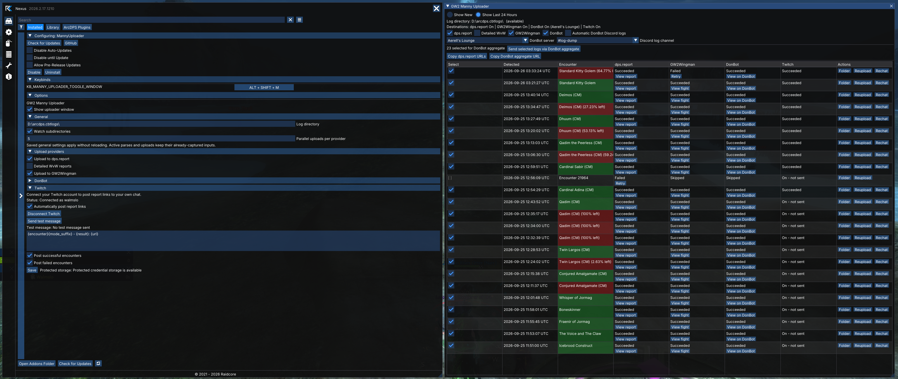
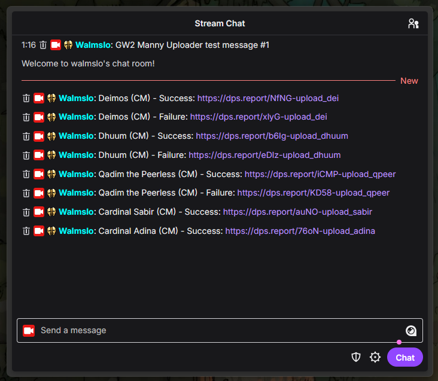

# GW2 Manny Uploader

Automatically upload arcdps logs to dps.report, GW2Wingman, and DonBot, and post report links to your Twitch chat. Supports Windows and Wine/Proton.

## Install

Requires [Raidcore Nexus](https://raidcore.gg/gw2/nexus) and arcdps saving compressed `.zevtc` logs.

1. Download the Windows x64 ZIP from the [latest release](https://github.com/LoganWal/GW2-MannyUploader/releases/latest).
2. Extract `manny_uploader.dll` into `<Guild Wars 2>\addons\`.
3. Launch the game, enable MannyUploader in Nexus, and choose destinations in Nexus options > MannyUploader.

To update, unload the addon in Nexus before replacing the DLL.

## Use

Open the list from the quick-access icon or Alt+Shift+M.

- Log folder: defaults to `<Guild Wars 2>\arcdps.cbtlogs`. Change it in options if needed.
- Show New: watches logs completed after the addon loads. Show Last 24 Hours: includes the previous day's logs.
- Copy links: copy dps.report URLs or one DonBot aggregate URL for selected fights.
- Reupload / Rechat: explicitly resend a log or Twitch message. Upload history prevents automatic repeats across restarts.



## Connect destinations

- dps.report / GW2Wingman: enabled by default. Toggle them in the list or options.
- DonBot: enter your GW2 API key, select Verify DonBot, choose an authorized server, then enable uploads. Discord summaries are optional.
- Twitch: select Connect Twitch, authorize your broadcaster account, then enable Automatically post report links. Requires dps.report. Keep the authorization browser window off stream.

With dps.report enabled, the other destinations wait for its link. Without it, Wingman and DonBot upload directly.



Credentials use protected storage. Wine provides weaker protection, flagged in options. Disconnect DonBot and Twitch before permanently removing the addon.

## Troubleshooting

- Missing logs: check the log folder, subdirectory option, and that arcdps saves `.zevtc` files.
- Addon missing: check that `manny_uploader.dll` is directly inside the game's `addons` folder.
- Upload failed: check the row's status and use the offered retry.
- [Report an issue](https://github.com/LoganWal/GW2-MannyUploader/issues) with versions, status text, and reproduction steps. Leave out credentials and private data.

## Development

Requires CMake 3.25+, Ninja, and C++23. Production builds use MSVC x64. GCC/Clang cover the portable core. Dependencies download automatically.

```sh
cmake --preset dev
cmake --build --preset dev
ctest --preset dev
```

Use `release` instead of `dev` for an optimized build. Full maintainer preflight: `./tools/preflight-msvc-wine.sh`. Native Windows CI remains the OS validation gate.

[Architecture](docs/architecture/overview.md) | [Behavior contracts](docs/contracts/README.md) | [Windows validation](docs/release/native-windows-validation.md) | [Release evidence](docs/release/evidence-template.md) | [Third-party licenses](THIRD_PARTY_NOTICES.md)
